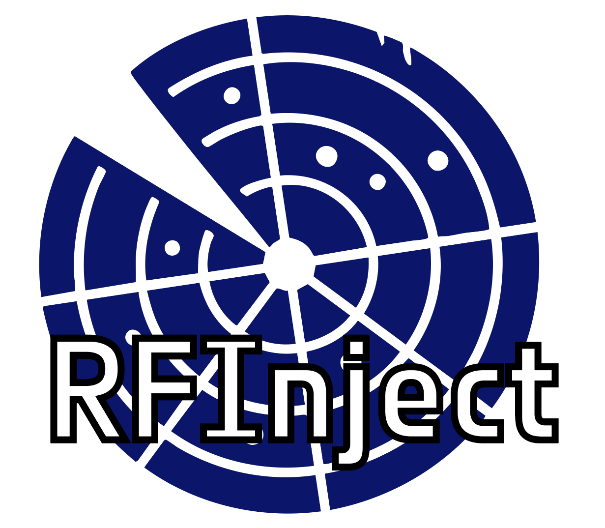

(For these shield to work, set proper name..)

    <strong>🌍 TRANSFORMING EARTH OBSERVATION IN ACTIONS FOR THE HUMAN PROSPERITY 🌍</strong>

## 📌 RFInject

## 👥 Authors

- Roberto Del Prete ([profile](https://www.linkedin.com/in/roberto-del-prete-8175a7147/))  
- Nermine Hendy ([profile](https://www.linkedin.com/in/nermine-hendy-18121069/))

## 📖 Project Reference

## 📝 Abstract

---

*For internal use only: This repository conforms to the ESA-PhiLab development and archiving standards.*
